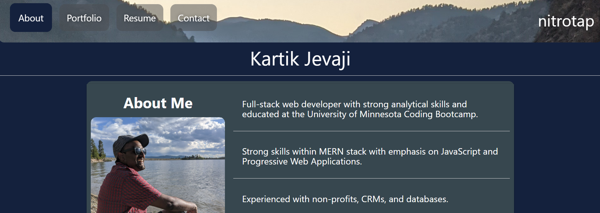

# react-folio

## Description

My personal portfolio made with React.

[Deployed](https://nitrotap.github.io/react-folio/)

  

  

## Table of Contents

- [Screen Shot](#Screen-Shot)
- [Questions](#Questions)
- [License](#License)

## Screen-Shot

## Questions

Please reach out to me on [GitHub](https://github.com/nitrotap) or by email at kartikinpublic@gmail.com for any additional questions.

## License

None
